# App uploading to the Industrial Edge Management

How to upload an application to the Industrial Edge Management

- [App uploading to the Industrial Edge Management](#app-uploading-to-the-industrial-edge-management)
  - [Description](#description)
    - [Overview](#overview)
    - [General task](#general-task)
  - [Requirements](#requirements)
    - [Used components](#used-components)
    - [Further requirements](#further-requirements)
  - [Downloading the Industrial Edge App Publisher](#Downloading-the-Industrial-Edge-App-Publisher)
  - [Installing the Industrial Edge App Publisher](#Installing-the-Industrial-Edge-App-Publisher)
  - [Uploading an Application to the IEM](#uploading-an-application-to-the-iem)
    - [Exposing Docker API to IE App Publisher](#exposing-docker-api-to-ie-app-publisher)
    - [Publishing the application to the IEM](#publishing-the-application-to-the-iem)
    - [Creating a new applicatio](#creating-a-new-application)
  - [New configuration](#new-configuration)
  - [Documentation](#documentation)
  - [Contribution](#contribution)
  - [Licence and Legal Information](#licence-and-legal-information)

## Description

### Overview

This document describes the steps to upload an application to an Industrial Edge Management.

### General task

Create a new project and application in the IEM and upload a dockerized application using the IE Publisher.

## Requirements

### Used components

- Industrial Edge App Publisher V1.27.9
- Docker Engine 27.0.
- Docker Compose V2.4
- Industrial Edge Management Pro V2.2.1

### Further requirements

- Access to an Industrial Edge Management System.
- A dockerized application with a `docker-compose.yml` file.
- The docker images of the `docker-compose.yml` file are successfully build or pulled and are available in the local docker registry. Use `docker-compose build` in the directory containing the `docker-compose.yml` file to build the docker images needed by the application.
- The docker engine of the development system is accessible to the IE Publisher.

## Downloading the Industrial Edge App Publisher

To obtain the App Publisher for Industrial Edge, one must firts download the app by purchasing it on the Industrial Edge Hub.
To download the App Publisher one must go to the Downloads>Software tab and to the Developer Tools. Here you choose the OS you are working with (preferably Ubuntu) and download the prefered version

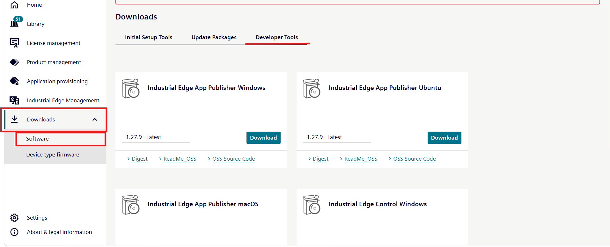

## Installing the Industrial Edge App Publisher

On Linux:
- Install with apt or dpkg Using the following comand on the terminal: sudo apt install ./<name-publisher>.deb

Where name-publisher is the path to the downloaded file (If you open the terminal on the same folder as the download only the file must be written)

On Windows:
- Execute the .msi file

## Uploading an Application to the IEM

To upload the application, it must first be created on the IE Publisher. Once the app is created, it can be uploaded to the IEM connected to the Publisher.

### Selecting workspace dierctory

The first step once the App Publisher is installed is to select a workspace on where the work done will be saved
To do this, select the workspace button, select a folder and click OK

Note! The folder used as a Workspace must be an empty folder

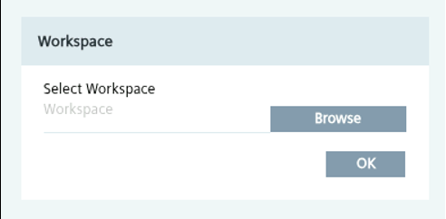

### Exposing Docker API to IE App Publisher

To expose the Docker API to the IE App Publisher, enter the following command:

    sudo systemctl edit docker.service

and add this text to the file

    [Service]
    ExecStart=
    ExecStart=/usr/bin/dockerd -H fd:// -H tcp://127.0.0.1:2375

This must be done on the following space or it will be discarded!:

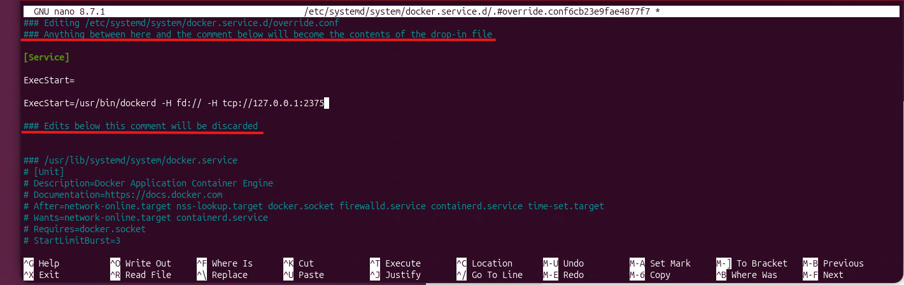

Now save the file, reload the *systemctl* configuration and restart docker.

    sudo systemctl daemon-reload
    sudo systemctl restart docker.service

To check that the API is exposed, run

    sudo netstat -lntp | grep dockerd  

You should see something similar to

    tcp    0    0 127.0.0.1:2375    0.0.0.0:*     LISTEN    3758/dockerd 

### Publishing the application to the IEM

- Click on "+ Docker Engine" and enter the IP and Port on which the docker socket is running. Make sure the docker engine is accessible to the IE Publisher. This docker engine must include all docker images specified in the `docker-compose.yml` file of the application
- Click on "Go Online" to connect the publisher with the IEM to start the wizard. The following information will be required:
  - Edge Management URL, click "Connect"
  - Sign in with your credentials.
  - Connect to the Docker Engine IP (either type localhost or 127.0.0.1 and 2375 as the Port)

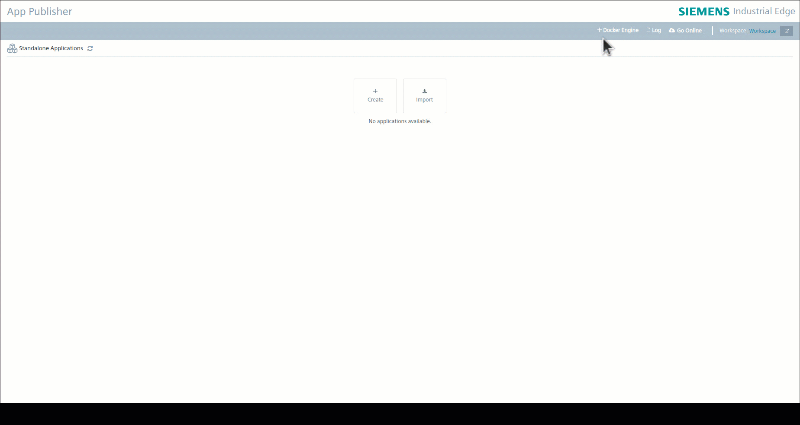

If you are logged in successfully, you will see the doccker engien address on the left hand corner. 

### Creating a new application

To create a new app:
- Click on the create button under Device Applications
- Name your application
- Introduce the repository name
- Write a brief description
- Add an icon
- Once all this is done, click on "create"

- Click on the application to start the process of adding a new version for uploading
- Click on "Add New Version", set the docker compose version according to your `docker-compose.yml` file, e.g `2.4`
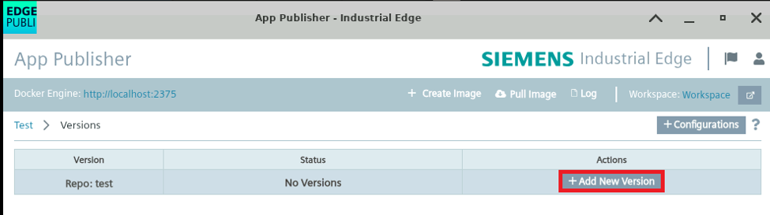
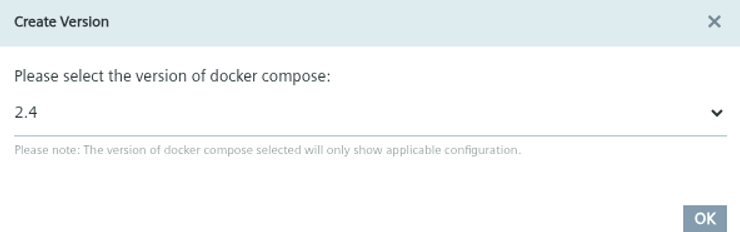
- Next the docker compose file must be created. There are two ways to continue with the process:
  1. Using the wizard
     
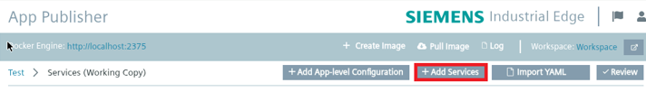  
  
  2. Using YAML Import

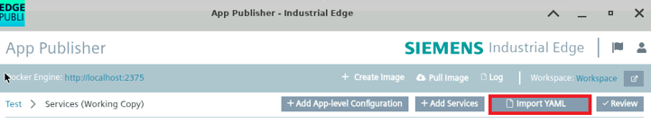

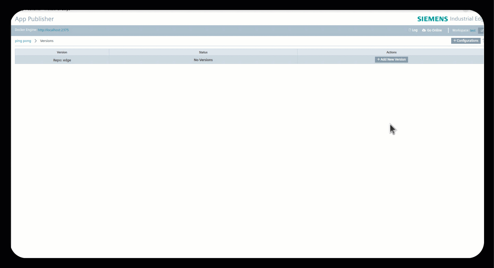
There are two ways of uploading the app to the IEM:

Directly from the APP PUBLISHER:
- Upload the app to the IEM by clicking on "Industrial Edge Management", click on yes to conmfirm double verification and wait for the upload to finish successfully

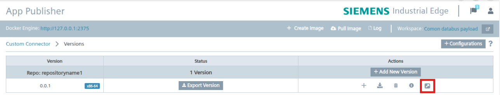

Directly from the IEM:
- On the App Publisher, use the export version button to export the app

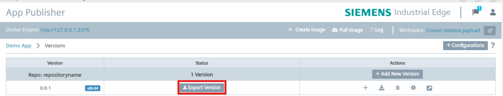
  
- On your IEM go to the Applications tab and click on the Add Application button. Here browse to select the exported file from the App Publisher and click Add

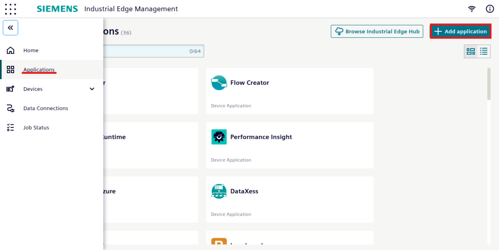
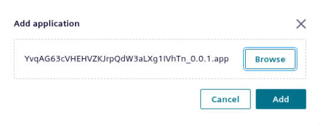

The application is now uploaded to the IEM and can be configured and deployed to a IE Device.

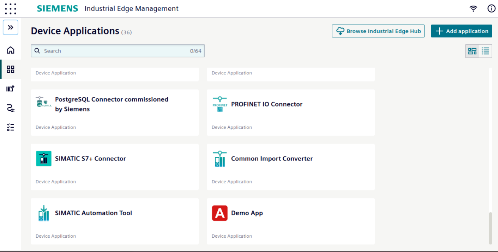

## New configuration
On the App Publisher, the configuration can be changed to suit the most appropriate type you must work with.
The 4 main App Configuration types are:
  - Versioned (the most common use case is root CAs using dropdown lists)
    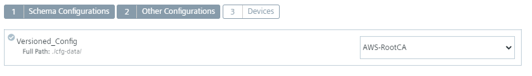
  - Unversioned (the most common use case is customer certificates using file upload)
    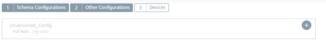
  - Templated (the most common use case is app configuration using editable template files)
    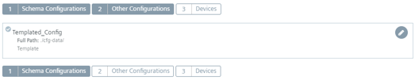
  - App Configuration Service (the most common use case is app configuration using inport form)
    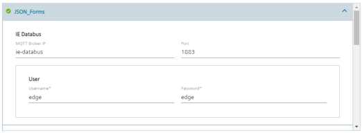

To add or change the configuration the following steps must be done:
1. Bind mount container to file system in docker compose yaml
2. Define bind mount as "host-path:container-path" (Hostpath must be defined as a relative path “./”)
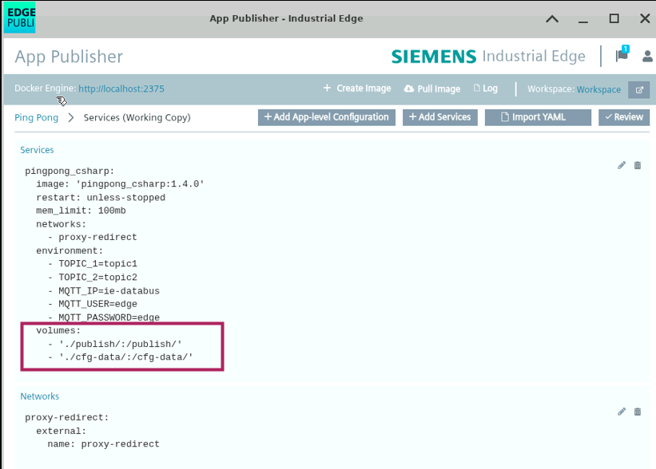
3. Create a new configuration on the App created
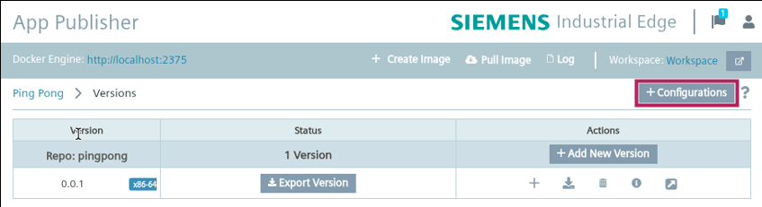
4. Follow the new configuration wizard (each one accoreding to the type desired)
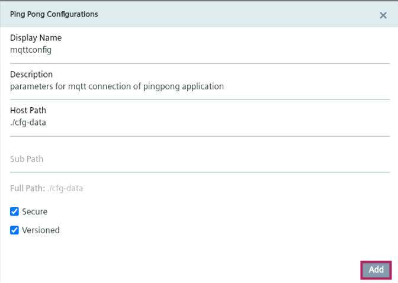
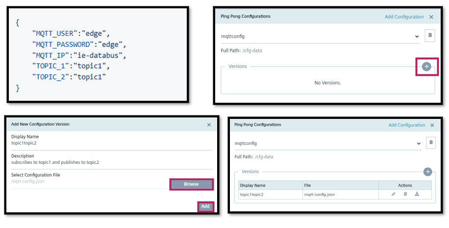
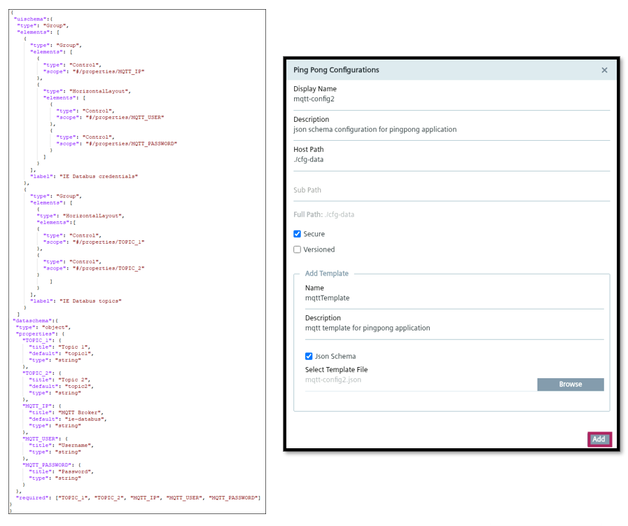

Once the configuration has been created and saved on the App Publisher, the uploaded app must be installed to the device with the new configuration. This will be done on the IEM
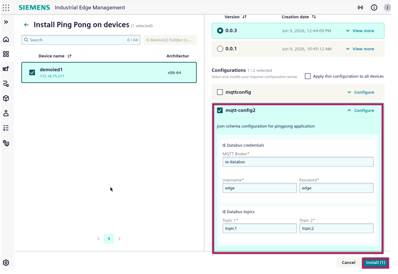

## Documentation

- You can find further documentation and help in the following links
  - [Industrial Edge Hub](https://iehub.eu1.edge.siemens.cloud/#/documentation)
  - [Industrial Edge Forum](https://www.siemens.com/industrial-edge-forum)
  - [Industrial Edge landing page](https://new.siemens.com/global/en/products/automation/topic-areas/industrial-edge/simatic-edge.html)
  
## Contribution

Thank you for your interest in contributing. Anybody is free to report bugs, unclear documentation, and other problems regarding this repository in the Issues section.
Additionally everybody is free to propose any changes to this repository using Pull Requests.

If you haven't previously signed the [Siemens Contributor License Agreement](https://cla-assistant.io/industrial-edge/) (CLA), the system will automatically prompt you to do so when you submit your Pull Request. This can be conveniently done through the CLA Assistant's online platform. Once the CLA is signed, your Pull Request will automatically be cleared and made ready for merging if all other test stages succeed.

## Licence and Legal Information

Please read the [Legal information](LICENSE.md).
