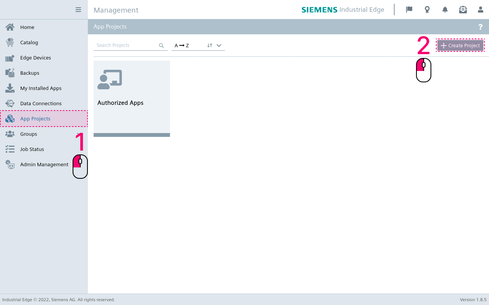
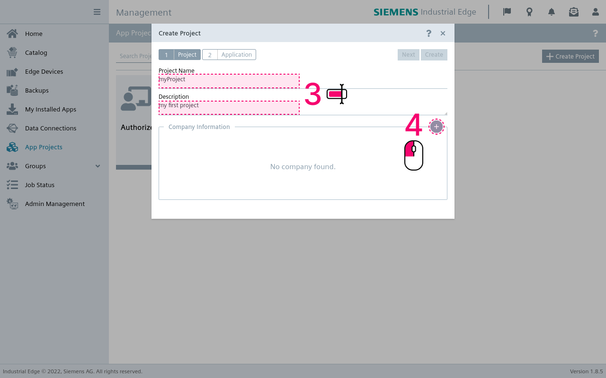
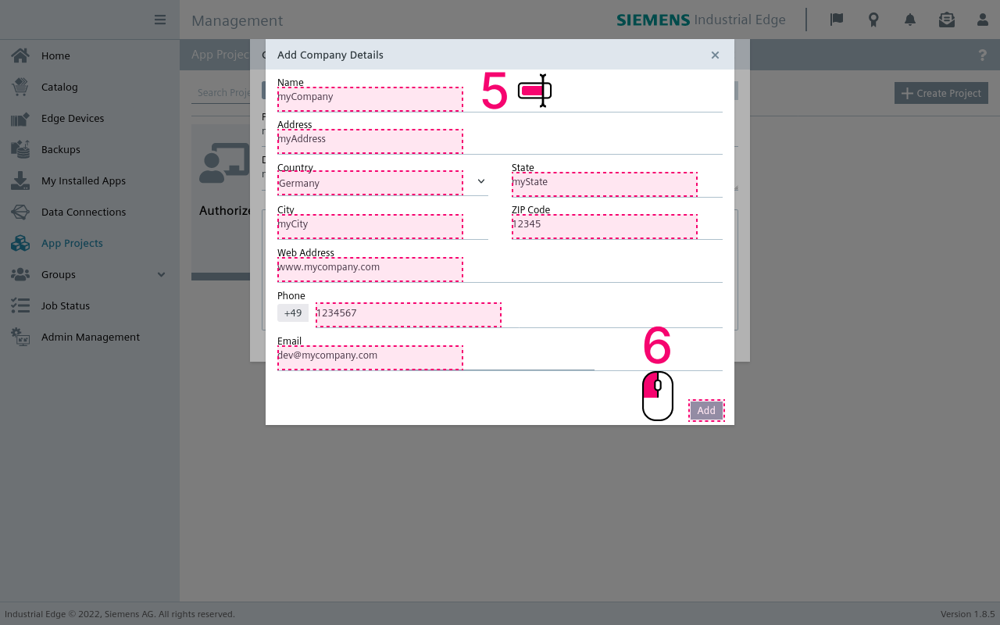
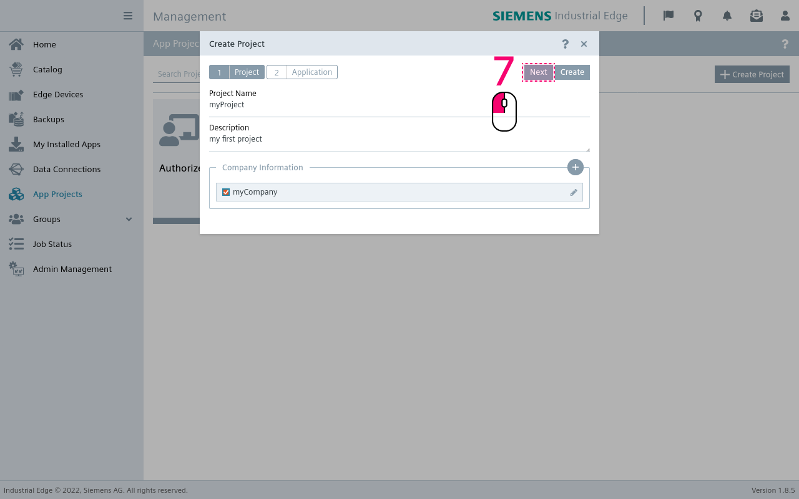
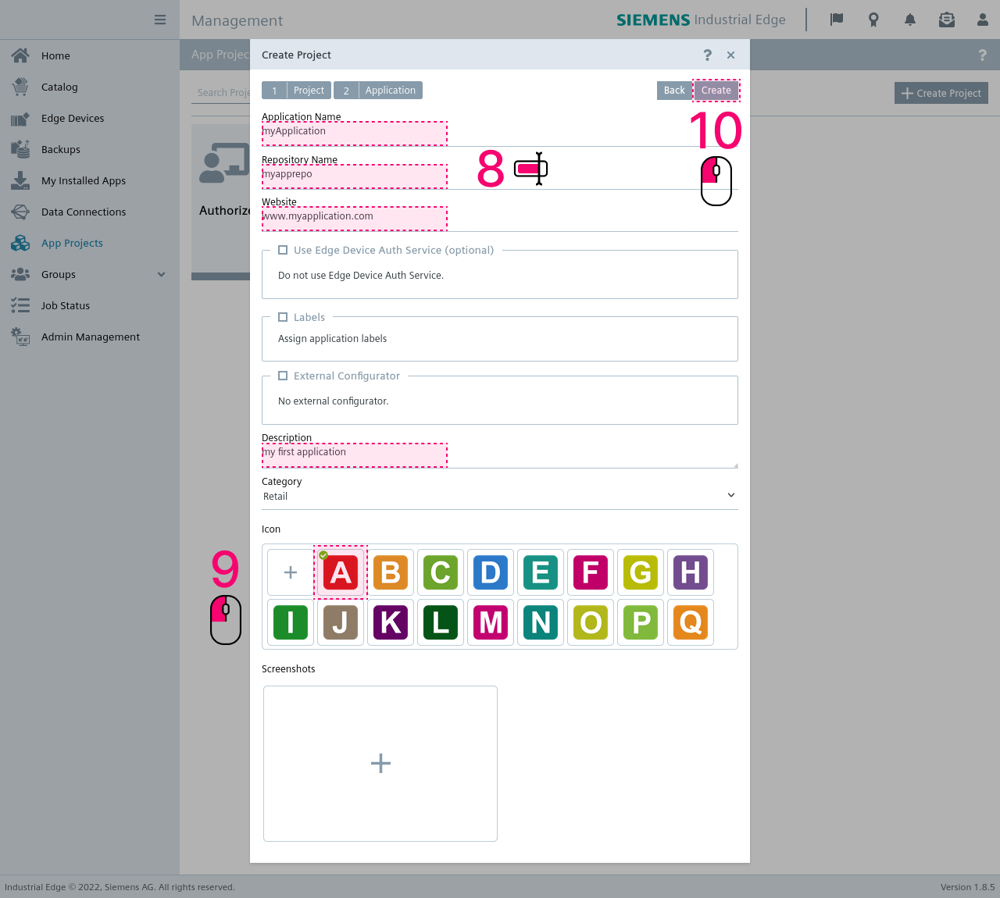
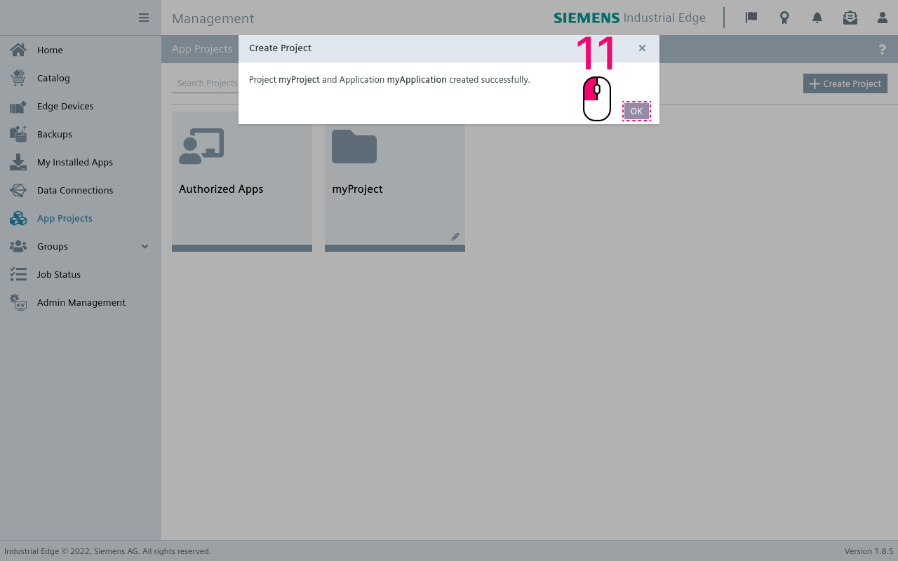

# App uploading to the Industrial Edge Management

How to upload an application to the Industrial Edge Management

- [App uploading to the Industrial Edge Management](#app-uploading-to-the-industrial-edge-management)
  - [Description](#description)
    - [Overview](#overview)
    - [General task](#general-task)
  - [Requirements](#requirements)
    - [Used components](#used-components)
    - [Further requirements](#further-requirements)
  - [Uploading an Application to the IEM](#uploading-an-application-to-the-iem)
    - [Creating a project and application in IEM](#creating-a-project-and-application-in-iem)
    - [Exposing Docker API to IE App Publisher](#exposing-docker-api-to-ie-app-publisher)
    - [Publishing the application to the IEM](#publishing-the-application-to-the-iem)
  - [Documentation](#documentation)
  - [Contribution](#contribution)
  - [Licence and Legal Information](#licence-and-legal-information)

## Description

### Overview

This document describes the steps to upload an application to an Industrial Edge Management.

### General task

Create a new project and application in the IEM and upload a dockerized application using the IE Publisher.

## Requirements

### Used components

- Industrial Edge App Publisher V1.0.0
- Docker Engine 18.09.6
- Docker Compose V2.4

### Further requirements

- Access to an Industrial Edge Management System.
- A dockerized application with a `docker-compose.yml` file.
- The docker images of the `docker-compose.yml` file are successfully build or pulled and are available in the local docker registry. Use `docker-compose build` in the directory containing the `docker-compose.yml` file to build the docker images needed by the application.
- The docker engine of the development system is accessible to the IE Publisher.

## Uploading an Application to the IEM

To upload the application, a project with an application has to be created in the IEM first. After that, a dockerized application can be uploaded using the IE Publisher.

### Creating a project and application in IEM

In the IEM Webinterface:

1. Navigate to the "App Projects" tab.
2. Click on "Create Project" button.
   

3. Enter a project name and description.
4. Click on the "+" button to add a new company.
   

5. Enter name, address, country, state, city, zip-code, website, phone number and email.
6. Click "Add" to add new company and assign it to the project.

7. Click "Next" to create a new application which will be added to the project.
 

8. Enter name, repository name, website and description of the app. The repository name must be unique for the IEM.
9. Select your desired application icon.
10. Click on "Create" to create application inside the project.

11. Confirm the information dialog by clicking on "OK".

Now a project containing one application is created. To upload it using the IE App Publisher, you first need to expose the Docker API.

### Exposing Docker API to IE App Publisher

To expose the Docker API to the IE App Publisher, enter the following command:

    sudo systemctl edit docker.service

and add this text to the file

    [Service]
    ExecStart=
    ExecStart=/usr/bin/dockerd -H fd:// -H tcp://127.0.0.1:2375

Now save the file, reload the *systemctl* configuration and restart docker.

    sudo systemctl daemon-reload
    sudo systemctl restart docker.service

To check that the API is exposed, run

    sudo netstat -lntp | grep dockerd  

You should see something similar to

    tcp    0    0 127.0.0.1:2375    0.0.0.0:*     LISTEN    3758/dockerd 

### Publishing the application to the IEM

First, the publisher has to connect to a docker engine and a IEM:

- Click on "+ Docker Engine" and enter the IP and Port on which the docker socket is running. Make sure the docker engine is accessible to the IE Publisher. This docker engine must include all docker images specified in the `docker-compose.yml` file of the application
- Click on "Go Online" to connect the publisher with the IEM
- Enter the Management URL, click "Connect" and log in with your credentials. 

If you are logged in successfully, you will see your newly created application in the "My Projects" Section.

- Click on the application to start the process of adding a new version for uploading
- Click on "Add New Version", set the docker compose version according to your `docker-compose.yml` file, e.g `2.4`
- Select the docker compose version according to your `docker-compose.yml` file
- Click on "Import YAML" and select the `docker-compose.yml` off the application in your file system
- The warning `Build (sevices >> <servicename> ) is not supported` can be ignored 
- Click on "Review" and "Validate and Create" and choose a version label, e.g `0.0.1`
- Enter the version of the application and click on "create"
- Upload the app to the IEM by clicking on "Start Upload" and wait for the upload to finish successfully

The application is now uploaded to the IEM and can be configured and deployed to a IE Device.

## Documentation

- You can find further documentation and help in the following links
  - [Industrial Edge Hub](https://iehub.eu1.edge.siemens.cloud/#/documentation)
  - [Industrial Edge Forum](https://www.siemens.com/industrial-edge-forum)
  - [Industrial Edge landing page](https://new.siemens.com/global/en/products/automation/topic-areas/industrial-edge/simatic-edge.html)
  
## Contribution

Thank you for your interest in contributing. Anybody is free to report bugs, unclear documentation, and other problems regarding this repository in the Issues section.
Additionally everybody is free to propose any changes to this repository using Pull Requests.

If you are interested in contributing via Pull Request, please check the [Contribution License Agreement](Siemens_CLA_1.1.pdf) and forward a signed copy to [industrialedge.industry@siemens.com](mailto:industrialedge.industry@siemens.com?subject=CLA%20Agreement%20Industrial-Edge).

## Licence and Legal Information

Please read the [Legal information](LICENSE.md).
